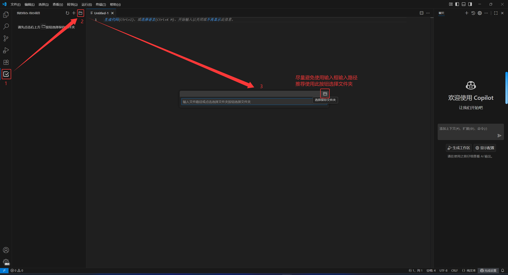
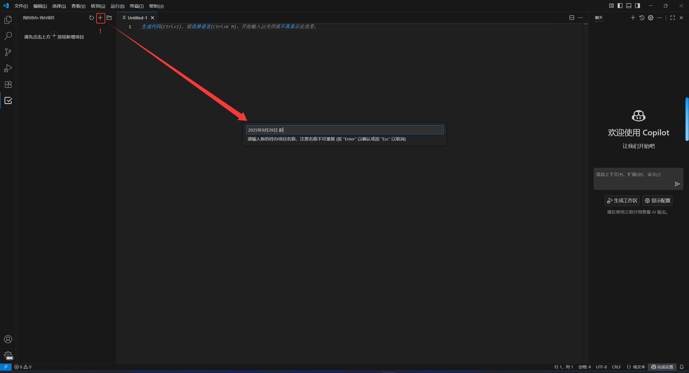
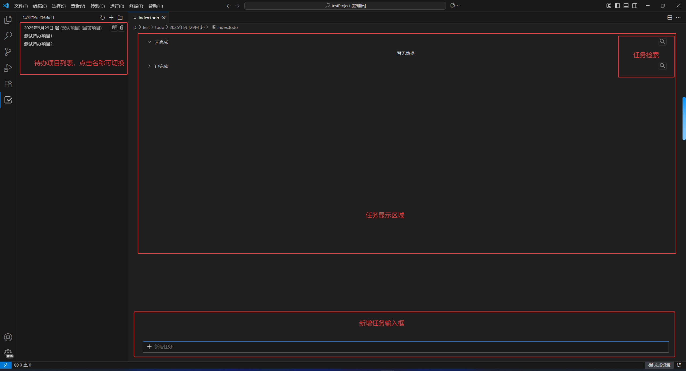

# 我的待办

在日常工作中，我经常遇到中途插入新需求的情况，导致有时会忘记正在处理的任务，因此经常使用待办事项软件。后来开始接触插件开发时，我决定开发一个类似的功能供自己使用。本插件在功能设计上参考了由于日常工作中经常被中途穿插需求，导致经常做一半忘了某件事，所以经常用到待办软件。后来开始接触插件开发时就选择做一个类似的功能来用，此插件在功能设计方面参考了[Microsoft To Do](https://to-do.office.com/tasks/zh-cn/)。

## 使用方式

1. 使用 VS Code 打开某个项目/文件夹
2. 安装本插件后，点击侧边栏的图标开始使用
3. 选择数据保存文件夹，具体步骤如下图所示：
4. 选择数据保存文件夹成功后，将看到以下页面，你可以按照页面提示创建项目，项目名称并无强制要求，可按照个人喜好更改。
5. 创建项目后，将看到以下界面。请参考下图了解项目布局：
6. 点击“新增任务”输入框，输入任意内容后按回车键，即可添加新的待办任务：
7. 任务详情面板功能有以下功能
   1. 修改任务内容
   2. 设置子任务
   3. 设置截止时间
   4. 添加附件
      

## 其他功能

### 快速增加附件

当你剪贴板第一张条是图片时（例如QQ或微信的截图功能），你可以点击任务详情区域的输入框并粘贴，即可快速添加为附件，如下图所示：

点击附件列表中的项可以查看附件文件。你可以在设置 `my-todo.vscodeOpenFileType` 中定义是否在 VS Code 中打开该附件。如果文件类型不在支持列表中，系统将调用系统 API 打开附件所在的文件夹。
